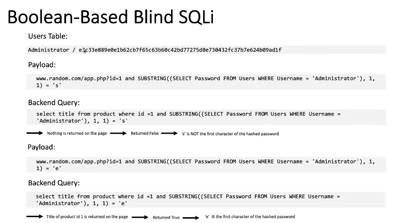

[SQLi Cheat Sheet](https://portswigger.net/web-security/sql-injection/cheat-sheet)

[SQL Injection](https://portswigger.net/web-security/sql-injection "SQL Injection")

SQL Injection Types:

- In-band (Classic)
- Inferential (Blind)
- Out-of-band

<ins>**In-band (Classic):**</ins>

- Occurs when the attacker uses the same communication channel to both launch the attack and gather the result of the attack. Retrieved data is presented directly in the application web page.
    - Error-Based SQLi - Forces the database to generate an error, giving the attacker information upon which to refine their injection.
    - Union-Based SQLi - Uses UNION SQL operator to combine the results of two queries into a single result set.
        - e.g. www.random.com/app/php?id===' UNION SELECT username, password FROM users--==
        - Using Union you need to match the number of columns and data types.
            - To match the columns use null or Order By 1 --
            - To identify data types use null and 'a'

**<ins>Inferential (Blind):</ins>**

- Where there is no actual transfer of data via the web application.
- Attackers are able to reconstruct the information by sending particular requests and observing the resulting behavior of the DB server.
    - Boolean-based SQLi
        - www.random.com/app.php?id=1 ==and 1=2== (False Statement)
        - www.random.com/app.php?id=1 ==and 1=1== (True Statement)  
           
            - Time-based SQLi

<ins>**Out-of-Band (OAST):**</ins>

- Triggering an out-of-band network connection to a system that you control. (Not common)
- Protocols like DNS / HTTP